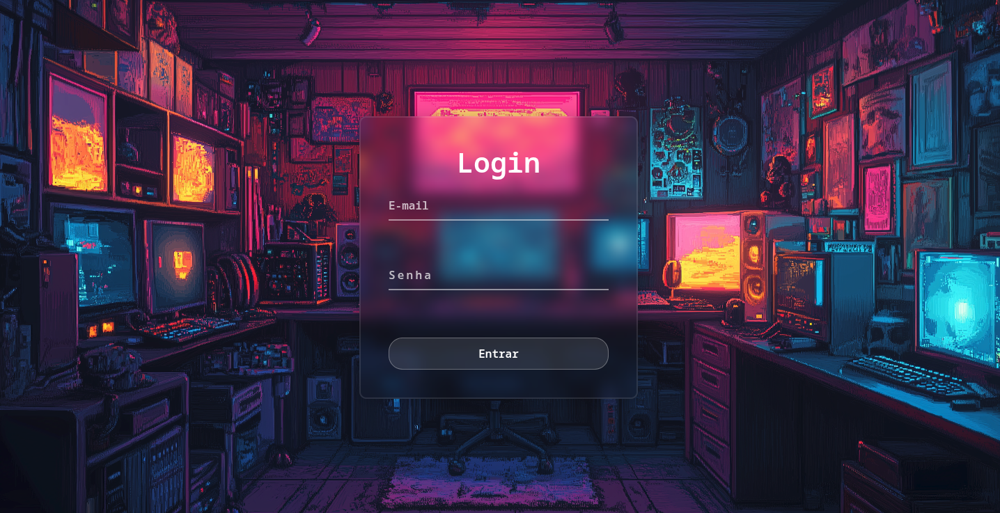
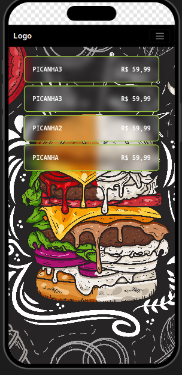

# Delivery-Felvic
> 🚧 Projeto em desenvolvimento ativo
## Descrição
Este é um sistema de delivery desenvolvido em PHP, permitindo o cadastro de clientes, login, gerenciamento de produtos, categorias e carrinho de compras.

## Funcionalidades
- Cadastro e login de clientes
- Gerenciamento de produtos
- Categorias de produtos
- Carrinho de compras
- Upload de imagens

## Tecnologias Utilizadas
- PHP
- MySQL
- HTML/CSS/JavaScript

## Instalação
1. Clone o repositório.
2. Configure o banco de dados em `app/config/conexao.php`.
3. Execute os scripts SQL em `database/` para criar as tabelas.
4. Configure um servidor web (ex: Apache) para apontar para `app/public/`.
5. Acesse via navegador.

## Uso
- Página inicial: `app/public/index.php`
- Cadastro: `app/views/auth/paginaDeCadastro.html`
- Login: `app/views/auth/paginaDeLogin.html`
- Produtos: `app/views/produtos/`
- Carrinho: `app/views/carrinho/index.php`

## Estrutura do Projeto
- `app/`: Código da aplicação
  - `config/`: Configurações
  - `controllers/`: Controladores
  - `models/`: Modelos
  - `public/`: Arquivos públicos
  - `views/`: Visualizações
- `database/`: Scripts do banco de dados
- `storage/`: Armazenamento de uploads

## Contribuição
Contribuições são bem-vindas. Faça um fork e envie um pull request.

## 📸 Preview

  
  
  

## Licença
Este projeto está sob a licença MIT.
